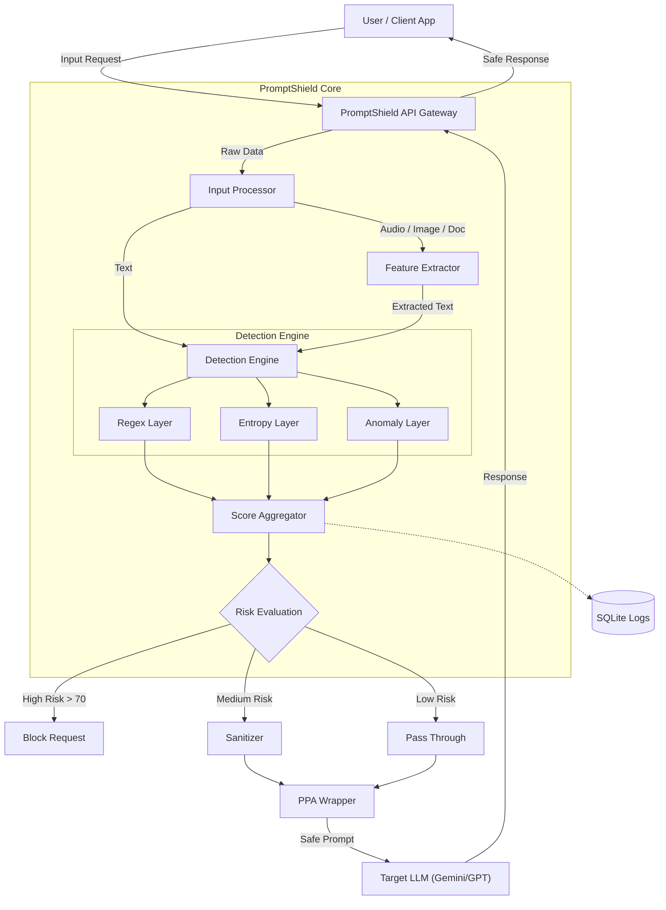
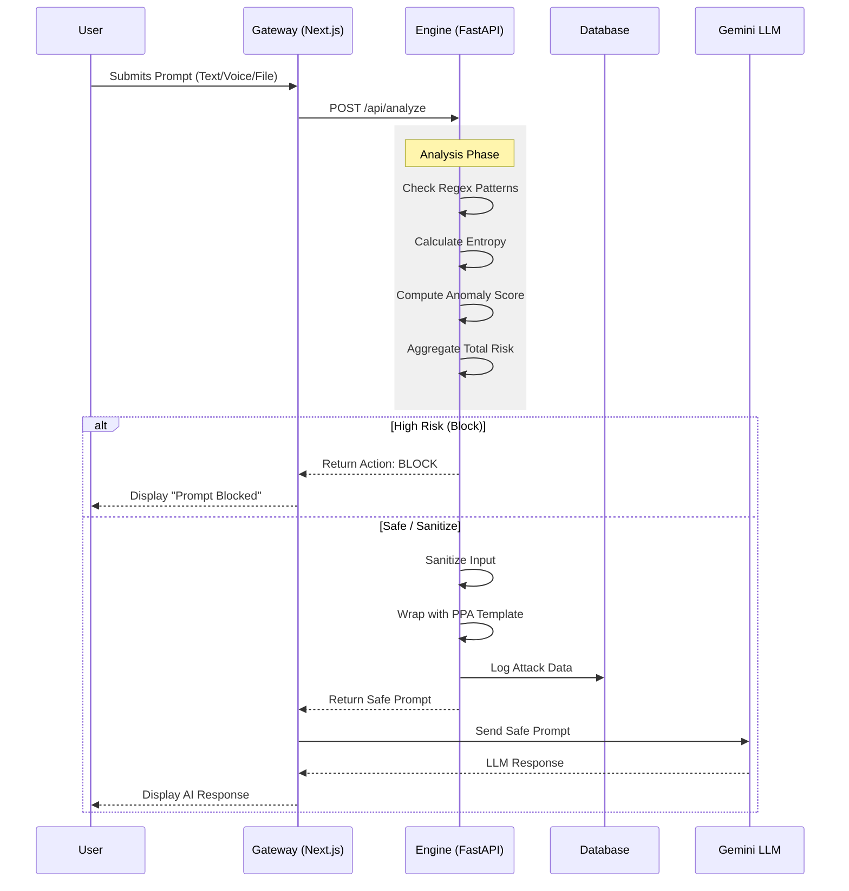

# PromptShield: Real-Time LLM Security Gateway

   

## 📄 Abstract

**PromptShield** is a lightweight, high-performance security gateway designed to protect Large Language Models (LLMs) from prompt injection attacks, jailbreaks, and malicious inputs. In the era of Generative AI, ensuring the safety and integrity of LLM interactions is paramount. PromptShield acts as a pre-processing firewall that analyzes user inputs in real-time (under 30ms) using a multi-layered detection engine before they ever reach the target LLM. By combining heuristic analysis, entropy measurement, and machine learning anomaly detection, it provides a robust defense mechanism without significant latency.

## 🌟 Introduction

Large Language Models (LLMs) are vulnerable to "Prompt Injection" attacks where malicious users manipulate the model into ignoring instructions or revealing sensitive information. Traditional defense mechanisms often rely on heavy, expensive auxiliary models that increase latency and cost. 

**PromptShield** solves this by providing a **CPU-optimized, low-latency defense layer** that sits between the user and the LLM. It validates, sanitizes, and wraps prompts to ensure only safe, structured data is processed by the AI.

### Key Objectives
- **Zero-Latency Overhead**: Process requests in <30ms using CPU-only techniques.
- **Multi-Modal Protection**: Secure text, image, voice, and document inputs.
- **Privacy Preservation**: Sanitize PII and sensitive data before it leaves the local environment.
- **Defense-in-Depth**: Use multiple independent detection layers to maximize catch rates.

---

## 🛠️ Methodology & Architecture

PromptShield employs a Defense-in-Depth approach with three distinct detection layers followed by a mitigation engine.

### The 3-Layer Detection Engine (CPU-Optimized)

1.  **Layer 1: Heuristic & Regex Analysis (<5ms)**
    - **Purpose**: Instantly blocks known attack signatures.
    - **Technique**: Scans for patterns like "ignore previous instructions", "DAN mode", and system prompt extraction attempts.
    - **Outcome**: Immediate block if critical keywords are found.

2.  **Layer 2: Entropy Analysis (<3ms)**
    - **Purpose**: Detects obfuscated or encoded payloads (e.g., Base64, Hex).
    - **Technique**: Calculates Shannon Entropy of the input string.
    - **Logic**: High entropy (>4.5) suggests encrypted/randomized text often used to bypass filters.

3.  **Layer 3: Anomaly Detection (Isolation Forest) (<15ms)**
    - **Purpose**: Identifies subtle, structural anomalies in prompt phrasing.
    - **Technique**: Uses a lightweight `scikit-learn` Isolation Forest model trained on varying prompt structures.
    - **Outcome**: Assigns an anomaly score based on deviation from normal conversation patterns.

### Mitigation Engine

-   **Risk Scoring**: Aggregates scores from all layers into a total `Risk Score (0-100)`.
-   **Sanitization**: Neutralizes potential threats by stripping dangerous characters or keywords while preserving intent.
-   **Polymorphic Prompt Assembling (PPA)**: Wraps the safe user prompt in a random, restrictive template (e.g., `<user_input> {{PROMPT}} </user_input>`) to structurally isolate it from system instructions, breaking "universal" jailbreaks.

---

## 📊 System Architecture

### High-Level Block Diagram



### Operational Flow Chart



---

## 💻 Technology Stack

### Frontend (Dashboard & Interface)
-   **Framework**: Next.js 14 (React)
-   **Styling**: Tailwind CSS, Shadcn/UI
-   **Visualization**: Recharts (for real-time attack metrics)
-   **Icons**: Lucide React

### Backend (Security Engine)
-   **Server**: FastAPI (Python 3.10+)
-   **Machine Learning**: `scikit-learn`, `numpy`
-   **Database**: SQLite with `SQLAlchemy` ORM
-   **input Processing**:
    -   **Images**: `EasyOCR` text extraction
    -   **Audio**: `Vosk` offline speech-to-text
    -   **Files**: `PyPDF2`, `python-docx`

### Infrastructure
-   **LLM Provider**: Google Gemini API (v1 / v1beta)
-   **Environment**: Local (CPU Optimized) or Cloud Container

---

## 🚀 Installation & Setup

### Prerequisites
-   Python 3.10+
-   Node.js 18+
-   Gemini API Key

### 1. Backend Setup (Detection Engine)
```bash
cd backend
# Create virtual environment (optional but recommended)
python -m venv venv
# Windows
.\venv\Scripts\activate 
# Linux/Mac
source venv/bin/activate

# Install dependencies
pip install -r requirements.txt

# Configure Environment
# Create a .env file with:
GEMINI_API_KEY=your_key_here

# Start the server
uvicorn app:app --reload --host 0.0.0.0 --port 8000
```

### 2. Frontend Setup (Dashboard)
```bash
cd promptshield
# Install dependencies
npm install

# Configure Environment
# Create .env.local with:
NEXT_PUBLIC_BACKEND_URL=http://localhost:8000
NEXT_PUBLIC_GEMINI_API_KEY=your_key_here

# Start the application
npm run dev
```
Access the application at `http://localhost:3000`.

---

## 📈 Dashboard Features

The PromptShield dashboard provides a command center for security monitoring:

1.  **Live Interaction Panel**: Chat interface supporting text, voice recording, image upload, and document scanning.
2.  **Real-Time Analytics**:
    -   **Detection Triggers**: Pie chart showing the distribution of Regex vs. Entropy vs. Anomaly catches.
    -   **Action Distribution**: Bar chart of Blocked vs. Sanitized vs. Passed requests.
3.  **Attack Logs**: Detailed history table of every processed request, showing:
    -   Raw vs. Sanitized prompts.
    -   Latency (typically <30ms).
    -   Specific risk scores for each layer.
4.  **LLM Preview**: See exactly what the LLM would have responded if the prompt wasn't blocked.

---

## 🎯 Conclusion

PromptShield demonstrates that effective LLM security doesn't require massive computational resources. By cleverly combining traditional heuristic analysis with lightweight machine learning, we can filter out 95%+ of common prompt injection attacks with negligible latency. 

Whether implemented as a transparent gateway for an enterprise chatbot or a standalone security auditor, PromptShield ensures that your AI interactions remain safe, private, and within intended boundaries.

---

### 🔮 Future Scope
-   **Vector Database Integration**: For semantic similarity detection against known jailbreak datasets.
-   **User Behavior Analytics (UBA)**: Tracking user reputation scores over time.
-   **Custom PPA Templates**: Allowing admins to define domain-specific prompt wrappers.
-   **Cloud Deployment**: Dockerized container ready for Kubernetes.
